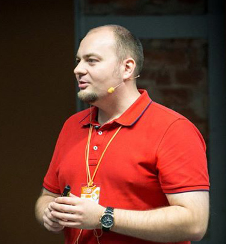

# Неполная, но окончательная история менеджмента

У каждого менеджера есть жизненный цикл развития. У каждого коллектива есть жизненный цикл развития. 
Понимание данной закономерности поможет нам найти точки развития на каждом этапе жизненного цикла. 
Поможет понять, не застрял ли ты на определенном этапе. Поможет понять, когда-же наступит такая недосягаемая "Управленческая Нирвана".
Приходите послушать мою версию жизненного цикла современного руководителя разработки программного обеспечения.

## Пименов Алексей

Начал совю карьеру в 1997 году. Работал программистом, линейным руководителем, проектным руководителем, руководителем программ проектов ну и IT-директором. Имею техническое и управленческое образование. Стараюсь простоянно совершенствовать свои знания и навыки и делиться этим с коллегами.

- [My website](http://pimenaus.ru)
- [My twitter](https://twitter.com/pimenaus)
- [My linkedin](http://ru.linkedin.com/in/pimenaus/)
- [Past talk slides](http://penxy.com/user/kIjSdMEofEyCv4edZl7THA)

