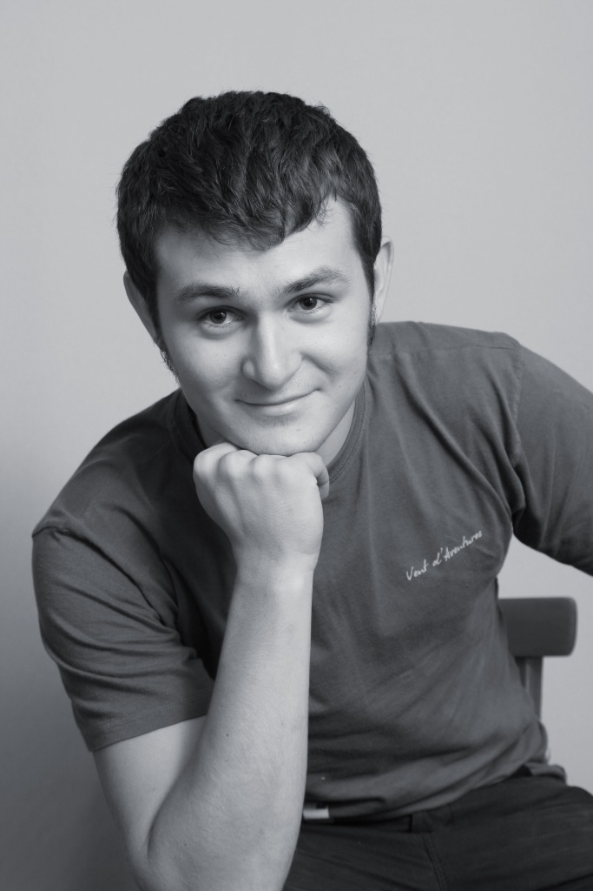

# Frontend development for the win!

Фундаментальный доклад про разработку больших, сложных и запутанных javascript-приложений. Отвечает на следующие вопросы и затрагивает следующие темы:

- Срыв покровов. Тонкости javascript, о которых вы не подозревали или стеснялись спросить.
- То, что принято называть минусами языка, на самом деле является мощным инструментом разработки.
- Среди великого многообразия современных фреймворков для разработки фронтэнд-приложений очень сложно сделать правильный выбор. Так что же выбрать? Я отвечу на этот вопрос.
- С какой стороны подойти к проектированию приложения с учетом всего, что вы узнали в предыдуших пунктах? Я расскажу весь процесс в деталях.
- В каком направлении развивается индустрия, а какие библиотеки безнадежно устарели? Неожиданные признания очевидцев.
- Bonus track. Немного про Om.

# Как мы написали новый поисковой движок

Некоторое время назад команда разработчиков aviasales.ru, базирующаяся на о. Пхукет, разработала новый поисковой движок Ясень. В новую версию движка архитектурно заложены отказоустойчивость и высокая производительность. Некоторые тезисы доклада:

- Rails не катит для чего-то нестандартного - с какими сложностями столкнулись мы.
- Попробуйте моделировать предметную область (это весело).
- Попробуйте функциональную декомпозицию (как красиво отказаться от ООП).
- SoA архитектура - много мелких сервисов со своим интерфейсом.
- Про нашу архитектуру, DSL и принципы работы.

## Антон Плешивцев

Кроссфункциональный разработчик команды aviasales.ru, расположенной на Пхукете и работающей над основным продуктом фирмы - поисковой выдачей. При моем непосредственном участии была спроектирована и разработана новая поисковая выдача ([search](http://search.aviasales.ru/)), карта низких цен ([map](http://map.aviasales.ru/)), библиотека наших ui-компонентов [Components](https://github.com/KosyanMedia/components), новый высокопроизводительный поисковой движок Ясень и несколько встраиваемых виджетов. Евангелист Angular.JS, использую в работе голову, Python и Ruby, написал некоторые спорные [штуки на Haskell](https://github.com/allaud/HHydra), автор известного в узких кругах [сервиса быстрых скриншотов](http://cropme.ru/). Последнее время проявляю живой интерес к Clojure.

- [My website](http://allaud.tumblr.com/)
- [My twitter](https://twitter.com/allaud)
- [Мои слайды с HappyDev в Омске](http://allaud.tumblr.com/post/70195320178/happydev13)
- [Я на Стачке в прошлом году, см. Кинобар](http://nastachku.ru/pages/broadcast)
