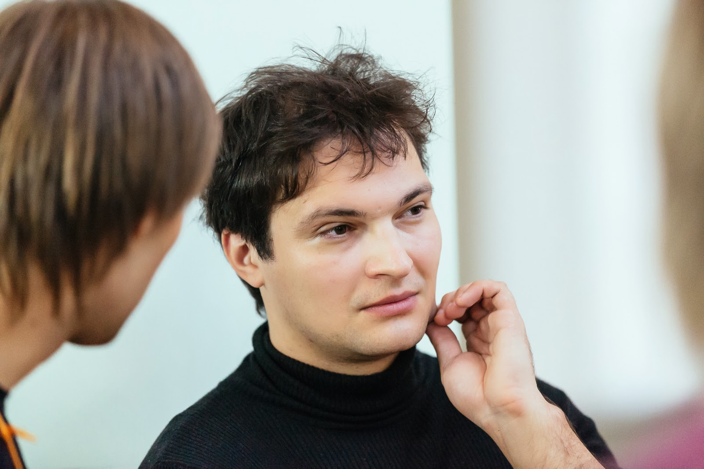

# Работаем со сложной предметной областью

Программирование - прикладная дисциплина и порой нам нужно создавать информационные системы
для незнакомой и сложной предметной области, когда простого здравого смысла уже не хватает, а овладение экспертизой
требует многих лет (высшего) образования и практики. Можно попробовать все упростить до формочек и табличек или усложнить
до декорируемых абстрактных фабрик адаптирующих мостов, но тогда градус абсурда начинает расти экспоненциально.

В докладе я хотел бы рассказать про некоторые технические подходы,
которые мы применяли для борьбы со сложностью в процессе разработки медицинской системы:

* Прототипирование и короткие итерации
* Use Case Driven Development и почему MVC иногда плохо работает
* Domain Driven Design как ментальный фреймворк
* Стандарты и кодо-генерация
* Существенная и Случайная Сложность - простота как залог долголетия

## Николай Рыжиков

Технический лидер (художественный руководитель) команды "health samurai" (waveaccess/hospital-systems),
которая уже 6 лет делает на ruby медицинские корпоративные приложения для США.
Активист питерского руби сообщества SPRUG и мета-сообщества «piter-united».

- [Google Plus](https://plus.google.com/u/0/+%D0%9D%D0%B8%D0%BA%D0%BE%D0%BB%D0%B0%D0%B9%D0%A0%D1%8B%D0%B6%D0%B8%D0%BA%D0%BE%D0%B2/posts)
- [Twitter](https://twitter.com/niquola)
- [Blog](http://niquola.github.io/blog/)
- [Past talk slides](https://github.com/search?q=%40niquola+slides)
- [Past talk video](http://example.com)
